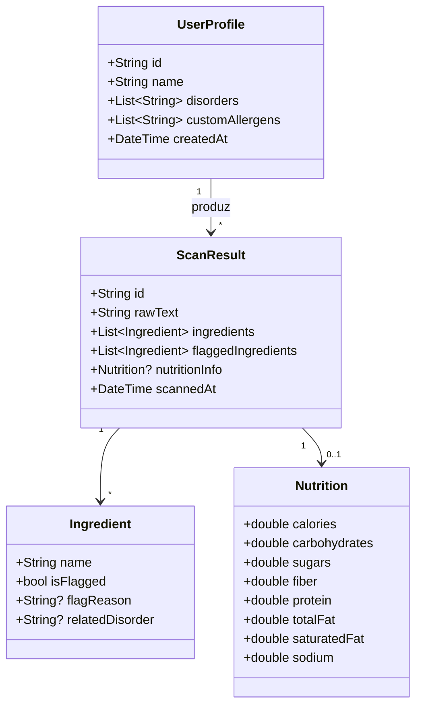
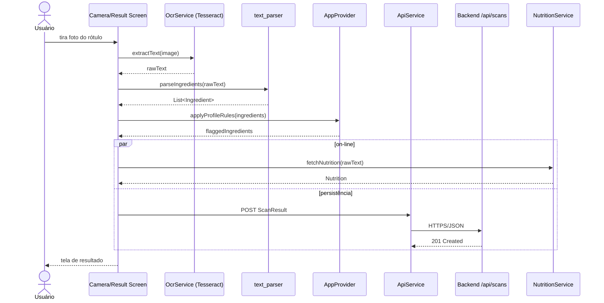

# Documento de Definição Arquitetural (DAS)

**Projeto:** NutriScan — Protótipo Assistivo com OCR e Análise Nutricional para Apoio a Pessoas com Distúrbios Digestivos
**Vínculo acadêmico:** Iniciação Tecnológica (PIBITI), PI07741-2024/2, Instituto de Informática — UFG
**Versão:** 1.0
**Status:** Em desenvolvimento (MVP)
**Padrões de referência:** ISO/IEC/IEEE 42010:2022 (*Architecture Description*); modelo **4+1 Views** de Kruchten (1995).
**Documentos relacionados:** [REQUIREMENTS.md](REQUIREMENTS.md), [SCOPE.md](SCOPE.md), [STACK.md](STACK.md).

---

## 1. Introdução

### 1.1 Propósito

Este documento descreve **como o sistema NutriScan é construído** — sua estrutura, decomposição em componentes, fluxos de execução, organização de código, implantação e modelo de dados. Complementa a [Especificação de Requisitos](REQUIREMENTS.md) (que responde *o quê*) e serve de referência para desenvolvimento, manutenção, avaliação acadêmica e futuras evoluções do protótipo.

### 1.2 Escopo

O documento cobre o aplicativo móvel (Flutter), o backend (Node.js/Express) e a integração com serviços externos (motor de OCR, API de nutrição). Está fora do escopo a infraestrutura de provedores comerciais (planos pagos, *clusters* dedicados), bem como serviços não previstos no MVP (autenticação federada, sincronização *multi-device*).

### 1.3 Stakeholders e Drivers Arquiteturais

| *Stakeholder* | Interesse principal |
|---|---|
| Usuário-paciente | OCR rápido e confiável, alertas claros, acessibilidade. |
| Orientadora / co-orientador | Reprodutibilidade, alinhamento com objetivos da IC. |
| Desenvolvedor (autor) | Manutenibilidade, baixo custo de iteração, CI/CD. |
| Avaliadores acadêmicos | Decisões rastreáveis, conformidade com normas (LGPD, WCAG). |

Os principais *drivers* arquiteturais (RNFs que moldaram a arquitetura) são:

- **D-OFF** Operação *offline-first*: OCR e regra de alerta funcionam sem rede (RNF16).
- **D-PRIV** Minimização de dados pessoais no servidor; OCR *on-device* (R1, RNF10–RNF15).
- **D-ACC** Acessibilidade WCAG 2.2 AA como requisito de primeira classe (RNF07–RNF09).
- **D-LOW** Baixo custo operacional, compatível com *free tier* (RNF17, R6).
- **D-MAN** Manutenibilidade e modularidade para um único desenvolvedor (RNF21–RNF23).

A RSL conduzida no projeto reforça esses *drivers*: a literatura aponta que soluções móveis com OCR *on-device* e foco em autogestão (Digesty, mySymptoms, Endive) são as mais adotadas e que envolvimento de usuários finais e adequação à acessibilidade são lacunas frequentes — o que justifica priorizá-los desde a arquitetura.

---

## 2. Representação Arquitetural

Adota-se o modelo **4+1 Views** de Kruchten, com notação **UML simplificada** e diagramas livres em ASCII/Mermaid, alinhada à ISO/IEC/IEEE 42010. As cinco visões cobrem:

- **Lógica** (Seção 4) — pacotes, classes, responsabilidades.
- **Processo** (Seção 5) — fluxos em tempo de execução.
- **Desenvolvimento** (Seção 6) — código e *build*.
- **Física / Deployment** (Seção 7) — distribuição em máquinas.
- **Cenários** (Seção 9) — casos de uso que atravessam as visões.

Visão de **Dados** (Seção 8) é apresentada separadamente por sua centralidade no projeto.

---

## 3. Metas e Restrições Arquiteturais

### 3.1 Metas

- **M1** OCR de rótulo concluído em ≤ 5 s em dispositivo de gama média (RNF01).
- **M2** Funcionar sem internet para o fluxo essencial (captura → OCR → alerta).
- **M3** Backend simples, *stateless*, hospedável em *free tier* (Heroku/Render/Railway).
- **M4** Código modular separando UI, serviços e modelos (RNF21).
- **M5** Conformidade verificável com LGPD e WCAG 2.2 AA.

### 3.2 Restrições

- **C1** OCR *on-device* via Tesseract — limita portabilidade web e impacta tamanho do APK.
- **C2** Persistência apenas em MongoDB (NoSQL), sem ORM relacional.
- **C3** API REST/JSON, sem GraphQL ou gRPC.
- **C4** Stack obrigatória pelo plano de IC: **Flutter + Node.js + MongoDB + Tesseract**.
- **C5** Um único desenvolvedor — privilegiar simplicidade sobre sofisticação prematura.

---

## 4. Visão Lógica

O sistema decompõe-se em **dois subsistemas** comunicando-se por HTTP/JSON, mais um conjunto de **serviços externos**.

```
+----------------------------------+        HTTPS/JSON       +-------------------------+
|         App Móvel (Flutter)      |  <===================>  |   Backend (Node.js)     |
|  - screens, widgets              |                         |  - routes (REST)        |
|  - providers (estado)            |                         |  - models (Mongoose)    |
|  - services (OCR, API, Nutrição) |                         |  - regra de alerta      |
|  - models, utils                 |                         +-----------+-------------+
+-----------------+----------------+                                     |
                  |                                                      v
                  | Tesseract (on-device)                         +--------------+
                  v                                               |   MongoDB    |
            Câmera / galeria                                      +--------------+
                                                                  ^
                                                                  |
                                                          +-------------------+
                                                          |  API de Nutrição  |
                                                          |  (ex.: OpenFood)  |
                                                          +-------------------+
```

### 4.1 Pacotes do App Móvel

| Pacote | Responsabilidade |
|---|---|
| [`mobile/lib/core/`](../mobile/lib/core/) | Tema, constantes globais, paleta acessível. |
| [`mobile/lib/models/`](../mobile/lib/models/) | Entidades imutáveis (`UserProfile`, `ScanResult`, `Ingredient`, `Nutrition`). |
| [`mobile/lib/services/`](../mobile/lib/services/) | Integrações: `OcrService` (Tesseract), `NutritionService`, `ApiService`. |
| [`mobile/lib/providers/`](../mobile/lib/providers/) | `AppProvider` — gerência de estado (perfil, histórico). |
| [`mobile/lib/screens/`](../mobile/lib/screens/) | Telas: Home, Profile, Camera/Scan, Result, History. |
| [`mobile/lib/widgets/`](../mobile/lib/widgets/) | Componentes reutilizáveis (botões, *cards* de ingrediente). |
| [`mobile/lib/utils/`](../mobile/lib/utils/) | `text_parser` (extração de lista de ingredientes do `raw_text`). |

### 4.2 Pacotes do Backend

| Pacote | Responsabilidade |
|---|---|
| [`backend/src/server.js`](../backend/src/server.js) | *Bootstrap*, *middlewares*, CORS, conexão Mongo. |
| [`backend/src/routes/`](../backend/src/routes/) | `profiles.js`, `scans.js` — CRUD REST. |
| [`backend/src/models/`](../backend/src/models/) | Schemas Mongoose: `UserProfile.js`, `ScanResult.js`. |

### 4.3 Diagrama de Classes (entidades-chave)



---

## 5. Visão de Processo

### 5.1 Fluxo Principal — Análise de Rótulo



### 5.2 Decisões de Concorrência

- OCR roda em *isolate* do Dart para não bloquear a UI thread.
- Chamadas a backend e API de nutrição ocorrem em paralelo (`Future.wait`), mas a UI é renderizada assim que a regra local de alerta termina — degradação graciosa em caso de falha de rede (RNF18).

---

## 6. Visão de Desenvolvimento

### 6.1 Estrutura de Diretórios

```
assistive-nutrition-ocr/
├── backend/
│   ├── package.json
│   └── src/
│       ├── server.js
│       ├── models/        # UserProfile.js, ScanResult.js
│       └── routes/        # profiles.js, scans.js
├── mobile/
│   ├── pubspec.yaml
│   └── lib/
│       ├── main.dart
│       ├── core/          # theme, constants
│       ├── models/        # UserProfile, ScanResult, Ingredient, Nutrition
│       ├── providers/     # AppProvider (ChangeNotifier)
│       ├── screens/       # home, profile, camera, scan, result, history
│       ├── services/      # ocr_service, api_service, nutrition_service
│       ├── utils/         # text_parser
│       └── widgets/       # ingredient_card, primary_button
└── docs/                  # ERS, DAS, STACK, SCOPE, RSL
```

### 6.2 Convenções

- **Dart:** *lint* `flutter_lints`; *snake_case* em arquivos, *UpperCamelCase* em classes.
- **JavaScript:** ESLint padrão Node; CommonJS; *kebab-case* em arquivos de rota.
- **Commits:** *Conventional Commits* (`feat:`, `fix:`, `docs:`).
- **Branches:** *trunk-based* com *feature branches* curtas e PRs revisados.

### 6.3 *Build* e CI/CD

| Etapa | Ferramenta |
|---|---|
| Lint/format mobile | `flutter analyze`, `dart format` |
| Testes mobile | `flutter test` |
| Lint backend | `eslint` |
| Testes backend | `jest` |
| CI | GitHub Actions (job por *push* na *main*) |
| *Deploy* backend | Heroku / Render / Railway (*free tier*) |
| Distribuição mobile | APK assinado em *releases* do GitHub (MVP) |

---

## 7. Visão Física (*Deployment*)

```
+-------------------------------+        HTTPS         +--------------------------------+
|  Dispositivo do usuário        |  <===============>   |  PaaS (Heroku/Render/Railway)  |
|  - Android 8+                  |                      |  - Node.js LTS                 |
|  - App Flutter                 |                      |  - Express + Mongoose          |
|  - Tesseract (libs nativas)    |                      +---------------+----------------+
|  - SQLite/SharedPrefs (cache)  |                                      |
+-------------------------------+                                       v
                                                              +-------------------+
                                                              |  MongoDB Atlas    |
                                                              |  (free tier M0)   |
                                                              +-------------------+
                                                                       ^
                                                                       | HTTPS
                                                              +-------------------+
                                                              |  Open Food Facts  |
                                                              |  (API pública)    |
                                                              +-------------------+
```

- O app é **autônomo** para o fluxo essencial. O backend é opcional para sincronização e auditoria.
- Não há *load balancer* ou *cluster* — um único *dyno* atende ao MVP.
- TLS é terminado pelo PaaS; o backend não gerencia certificados.

---

## 8. Visão de Dados

### 8.1 Modelo Lógico (MongoDB / Mongoose)

**`UserProfile`**
```jsonc
{
  "_id": "ObjectId",
  "name": "string",
  "disorders": ["celiac", "lactose_intolerance"],
  "custom_allergens": ["amendoim"],
  "createdAt": "ISODate",
  "updatedAt": "ISODate"
}
```

**`ScanResult`**
```jsonc
{
  "_id": "ObjectId",
  "raw_text": "string",
  "ingredients": [
    { "name": "trigo", "is_flagged": true,
      "flag_reason": "trigo", "related_disorder": "celiac" }
  ],
  "flagged_ingredients": [/* subconjunto de ingredients */],
  "nutrition_info": {
    "calories": 0, "carbohydrates": 0, "sugars": 0, "fiber": 0,
    "protein": 0, "total_fat": 0, "saturated_fat": 0, "sodium": 0
  },
  "image_path": "string|null",
  "scanned_at": "ISODate"
}
```

### 8.2 Relacionamento e Estratégia

- **Não há referência explícita** entre `ScanResult` e `UserProfile` no MVP: o vínculo é pelo dispositivo (RN05). Isso simplifica a regra de minimização (D-PRIV) e dispensa autenticação.
- `flagged_ingredients` é **denormalizado** a partir de `ingredients` — escolha consciente para acelerar leitura no *front* e congelar a regra que originou cada alerta no momento da análise.

### 8.3 Sincronização Local ↔ Remoto

- O app guarda perfil e últimas análises localmente (cache).
- O envio ao backend é *fire-and-forget*: falha silenciosa **não** quebra a UX (RNF18). Itens não sincronizados são reenviados na próxima janela com rede.

---

## 9. Cenários (+1 View)

Três cenários cruzam todas as visões e validam a arquitetura. Os demais estão na ERS.

### Cenário A — Escanear rótulo (UC02, caminho feliz)

Cruza: serviços móveis (Visão Lógica) → fluxo paralelo (Visão de Processo) → backend + MongoDB Atlas (Visão Física) → persistência de `ScanResult` (Visão de Dados).

### Cenário B — Uso *offline* em supermercado (RNF16)

Sem rede: OCR e regra de alerta funcionam *on-device*; `NutritionService` retorna `null`; `ApiService` enfileira `ScanResult` para envio posterior. Resultado é exibido em ≤ 5 s e marcado como "nutrição indisponível".

### Cenário C — Direito de eliminação (UC04, Art. 18 LGPD)

UI dispara `DELETE /api/profiles/:id` e `DELETE /api/scans/:id` em lote, e o `AppProvider` limpa o cache local. A ausência de vínculo formal usuário↔scan simplifica a operação e torna a conformidade verificável.

---

## 10. Decisões Arquiteturais (ADRs)

Resumo das decisões registradas. Cada ADR segue o formato **Contexto → Decisão → Consequências**.

### ADR-001 — Flutter para o cliente móvel
- **Contexto:** Plano de IC exige protótipo móvel acessível, com uma base de código.
- **Decisão:** Flutter (Dart) como *framework* único para Android (e iOS futuro).
- **Consequências:** **+** *hot reload*, base única, ecossistema de plugins (incl. Tesseract). **−** binário maior; suporte a desktop/web restrito por dependência nativa do OCR.

### ADR-002 — Tesseract *on-device* em vez de OCR em nuvem
- **Contexto:** *Drivers* D-OFF (offline) e D-PRIV (privacidade).
- **Decisão:** OCR local via plugin Flutter para Tesseract.
- **Consequências:** **+** funciona sem rede, sem envio de imagem a terceiros, custo zero. **−** acurácia menor que serviços comerciais; tamanho do APK cresce com modelos de idioma.

### ADR-003 — Node.js + Express para o backend
- **Contexto:** Familiaridade do autor; necessidade de API REST simples.
- **Decisão:** Node.js (LTS) + Express, sem TypeScript no MVP.
- **Consequências:** **+** *time-to-first-endpoint* baixo, vasta documentação. **−** tipagem dinâmica exige disciplina nos *schemas* (mitigado por Mongoose).

### ADR-004 — MongoDB (Mongoose) em vez de PostgreSQL
- **Contexto:** Modelos heterogêneos (`raw_text`, `nutrition_info` opcional, listas aninhadas).
- **Decisão:** MongoDB com Mongoose.
- **Consequências:** **+** documentos aninhados sem *joins*; Atlas *free tier*. **−** ausência de garantias relacionais — aceita por o domínio ser orientado a documentos.

### ADR-005 — Provider (em vez de Riverpod/Bloc)
- **Contexto:** Equipe de um desenvolvedor, escopo MVP.
- **Decisão:** `provider` + `ChangeNotifier` para gerência de estado.
- **Consequências:** **+** curva curta, oficial do time Flutter, suficiente para o MVP. **−** menos disciplina arquitetural que Bloc em projetos grandes — aceitável dado o escopo.

### ADR-006 — REST/JSON em vez de GraphQL
- **Contexto:** Poucos *endpoints*, acesso previsível, ferramentas de teste maduras.
- **Decisão:** REST com rotas `/api/profiles` e `/api/scans`.
- **Consequências:** **+** simplicidade, *caching* HTTP, fácil de testar com `curl`/Postman. **−** *over-fetching* possível — não relevante no MVP.

### ADR-007 — Regra de alerta executada também no cliente
- **Contexto:** Necessidade de operação *offline* (D-OFF).
- **Decisão:** Tabela canônica de gatilhos (RN02) é embarcada no app e espelhada no backend.
- **Consequências:** **+** alertas funcionam sem rede. **−** dupla manutenção da tabela — mitigado por versionamento e *changelog* únicos.

### ADR-008 — Sem autenticação no MVP
- **Contexto:** Minimização de dados (D-PRIV) e ausência de necessidade clínica.
- **Decisão:** Vínculo por dispositivo; sem login.
- **Consequências:** **+** menos dados pessoais, conformidade LGPD facilitada. **−** sem sincronização entre dispositivos — explícito na ERS como fora do escopo.

---

## 11. Riscos e *Trade-offs*

| ID | Risco / *Trade-off* | Impacto | Mitigação |
|---|---|---|---|
| RA-01 | OCR local com acurácia variável conforme iluminação/perspectiva. | Falsos negativos em alerta. | Pré-processamento (RF08); sinalização de baixa confiança (RNF25); novo *capture*. |
| RA-02 | Tesseract via plugin Flutter limita portabilidade desktop/web. | Restringe avaliação a Android. | Aceito no MVP; futura troca por ML Kit ou OCR em nuvem opcional. |
| RA-03 | Provider pode tornar-se insuficiente se o estado crescer (sincronização, *auth*). | Re-trabalho de estado. | Reavaliar Riverpod/Bloc na fase pós-MVP. |
| RA-04 | *Free tier* de PaaS dorme após inatividade. | Latência inicial > 2 s (viola RNF02 em *cold start*). | UI mostra estado de carregamento; *ping* periódico se necessário. |
| RA-05 | API externa de nutrição pode mudar contrato. | Quebra de RF12. | Camada `NutritionService` isolada; degradação graciosa (RNF18). |
| RA-06 | Regra de alerta duplicada (cliente + backend). | Divergência. | *Single source of truth* em arquivo JSON versionado e replicado no *build*. |
| RA-07 | Ausência de autenticação limita uso clínico real. | Não escala para profissionais de saúde. | Aceito no MVP; previsto como evolução. |
| RA-08 | Imagens potencialmente sensíveis se enviadas ao backend. | Risco LGPD. | Por padrão, **imagem não é enviada** — só `raw_text` e estruturas derivadas (RNF10). |

---

## 12. Controle de Versão do Documento

| Versão | Data | Autor | Mudanças |
|---|---|---|---|
| 1.0 | 2026-05-12 | José Fernandes (orient.: Profa. Elisangela Dias; co-orient.: Maurício Lima) | Versão inicial do DAS alinhada à ERS v1.0, ao Plano de IC PI07741-2024/2 e à RSL do projeto. |
